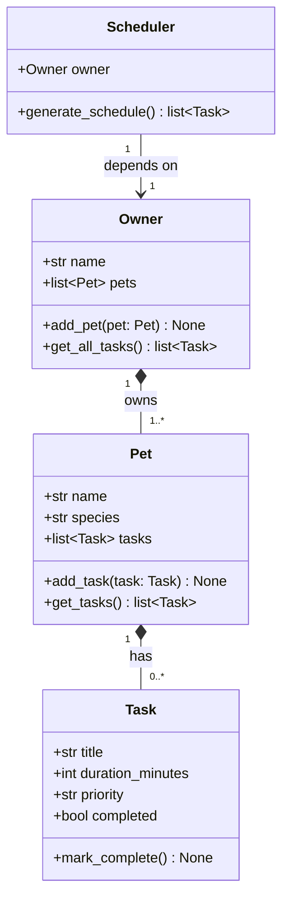

# PawPal+ Project Reflection

## 1. System Design

### Core user actions

Three actions a user should be able to perform with PawPal+:

1. **Register an owner and add pets** — The system needs to know who the owner is and which pet(s) they care for before anything else can happen. This is the entry point to the whole system.

2. **Add pet care tasks** — The owner should be able to create tasks (e.g., "Morning walk", "Feeding", "Medication") and attach them to a pet, specifying the title, duration, and priority. This is the core data-entry action.

3. **Generate a daily care schedule** — Given all the tasks entered, the system should produce an ordered daily plan that selects and prioritizes tasks based on their priority and duration.

---

**a. Initial design**

The design includes four classes: `Task`, `Pet`, `Owner`, and `Scheduler`.

**Task** (dataclass) is the smallest unit of work. It stores `title`, `duration_minutes`, `priority` ("low" / "medium" / "high"), and `completed`. It has one method, `mark_complete()`. Using a dataclass is appropriate because tasks are simple data records with no complex behavior at this stage.

**Pet** holds a pet's basic identity (`name`, `species`) and owns its own list of tasks. Methods: `add_task()` to attach a task, and `get_tasks()` to retrieve them. Keeping tasks on Pet (rather than a flat list on Owner) means task ownership stays clear even when there are multiple pets.

**Owner** is the top-level object. It stores the owner's `name` and a list of `pets`. Methods: `add_pet()` to register a pet, and `get_all_tasks()` to aggregate tasks across all pets. This aggregation method is the single access point for Scheduler, so task data is never stored in more than one place.

**Scheduler** holds a reference to an `Owner` and has one method: `generate_schedule()`, which will select and order tasks to build a daily plan. Scheduler does not store tasks — it reads them through Owner.

Relationships:
- Owner **owns** one or more Pets (composition).
- Pet **has** zero or more Tasks (composition).
- Scheduler **depends on** Owner to access tasks (association).

UML class diagram (Mermaid.js):

**b. Design changes**

The first draft of the design included several attributes and methods that turned out to be premature for Phase 1: `category`, `recurrence`, and `age_years` as attributes, and `reset()`, `priority_value()`, `explain_schedule()`, `get_pending_tasks()`, `remove_task()`, and `remove_pet()` as methods. After review, all of these were removed. They either anticipate Phase 2 logic (filtering, recurrence, explanation) or add complexity that cannot be justified yet. Keeping only the essentials makes each class easier to explain and easier to build on in the next phase.

---

## 2. Scheduling Logic and Tradeoffs

**a. Constraints and priorities**

The scheduler currently considers two constraints: **priority** and **duration**. Tasks marked "high" always appear before "medium" and "low" tasks. When two tasks share the same priority level, the shorter one is scheduled first. This "shortest job first within a priority tier" approach keeps the plan actionable — a busy owner can knock out several short high-priority tasks before tackling a longer one.

The priority ordering was chosen first because it directly reflects the owner's stated importance values. Duration was chosen as the secondary sort because it requires no extra input from the user (the field already exists) and produces a more realistic-feeling plan than arbitrary insertion order.

**b. Tradeoffs**

The main tradeoff is that the scheduler is **greedy and time-unaware**: it ranks and returns all pending tasks without checking whether the owner actually has enough time to complete them all. This means the plan can be longer than the owner's available time on a busy day.

This tradeoff is reasonable for Phase 4 because the assignment does not yet require the owner to declare a daily time budget. Adding a hard time cutoff would require either an `available_minutes` field on `Owner` or UI input for it — both are natural Phase 5 additions. For now, showing all pending tasks in priority order gives the owner a clear view of what matters most, and they can stop when they run out of time.

---

## 3. AI Collaboration

**a. How you used AI**

- How did you use AI tools during this project (for example: design brainstorming, debugging, refactoring)?
- What kinds of prompts or questions were most helpful?

**b. Judgment and verification**

- Describe one moment where you did not accept an AI suggestion as-is.
- How did you evaluate or verify what the AI suggested?

---

## 4. Testing and Verification

**a. What you tested**

- What behaviors did you test?
- Why were these tests important?

**b. Confidence**

- How confident are you that your scheduler works correctly?
- What edge cases would you test next if you had more time?

---

## 5. Reflection

**a. What went well**

- What part of this project are you most satisfied with?

**b. What you would improve**

- If you had another iteration, what would you improve or redesign?

**c. Key takeaway**

- What is one important thing you learned about designing systems or working with AI on this project?
