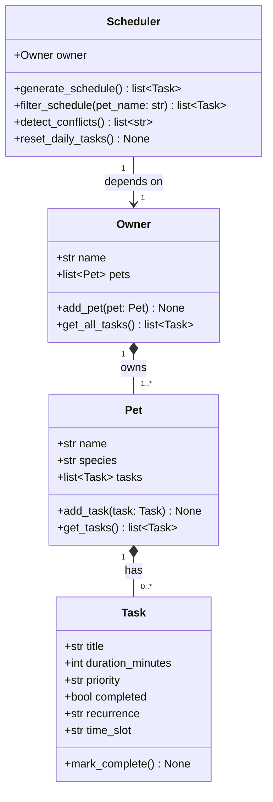

# PawPal+ Project Reflection

## 1. System Design

### Core user actions

Three actions a user should be able to perform with PawPal+:

1. **Register an owner and add pets** — The system needs to know who the owner is and which pet(s) they care for before anything else can happen. This is the entry point to the whole system.

2. **Add pet care tasks** — The owner should be able to create tasks (e.g., "Morning walk", "Feeding", "Medication") and attach them to a pet, specifying the title, duration, and priority. This is the core data-entry action.

3. **Generate a daily care schedule** — Given all the tasks entered, the system should produce an ordered daily plan that selects and prioritizes tasks based on their priority and duration.

---

**a. Initial design**

The design includes four classes: `Task`, `Pet`, `Owner`, and `Scheduler`.

**Task** (dataclass) is the smallest unit of work. It stores `title`, `duration_minutes`, `priority` ("low" / "medium" / "high"), and `completed`. It has one method, `mark_complete()`. Using a dataclass is appropriate because tasks are simple data records with no complex behavior at this stage.

**Pet** holds a pet's basic identity (`name`, `species`) and owns its own list of tasks. Methods: `add_task()` to attach a task, and `get_tasks()` to retrieve them. Keeping tasks on Pet (rather than a flat list on Owner) means task ownership stays clear even when there are multiple pets.

**Owner** is the top-level object. It stores the owner's `name` and a list of `pets`. Methods: `add_pet()` to register a pet, and `get_all_tasks()` to aggregate tasks across all pets. This aggregation method is the single access point for Scheduler, so task data is never stored in more than one place.

**Scheduler** holds a reference to an `Owner` and has one method: `generate_schedule()`, which will select and order tasks to build a daily plan. Scheduler does not store tasks — it reads them through Owner.

Relationships:
- Owner **owns** one or more Pets (composition).
- Pet **has** zero or more Tasks (composition).
- Scheduler **depends on** Owner to access tasks (association).

UML class diagram (Mermaid.js):

**b. Design changes**

The first draft of the design included several attributes and methods that turned out to be premature for Phase 1: `category`, `recurrence`, and `age_years` as attributes, and `reset()`, `priority_value()`, `explain_schedule()`, `get_pending_tasks()`, `remove_task()`, and `remove_pet()` as methods. After review, all of these were removed. They either anticipate Phase 2 logic (filtering, recurrence, explanation) or add complexity that cannot be justified yet. Keeping only the essentials makes each class easier to explain and easier to build on in the next phase.

---

## 2. Scheduling Logic and Tradeoffs

**a. Constraints and priorities**

The scheduler currently considers two constraints: **priority** and **duration**. Tasks marked "high" always appear before "medium" and "low" tasks. When two tasks share the same priority level, the shorter one is scheduled first. This "shortest job first within a priority tier" approach keeps the plan actionable — a busy owner can knock out several short high-priority tasks before tackling a longer one.

The priority ordering was chosen first because it directly reflects the owner's stated importance values. Duration was chosen as the secondary sort because it requires no extra input from the user (the field already exists) and produces a more realistic-feeling plan than arbitrary insertion order.

**b. Tradeoffs**

The main tradeoff is that the scheduler is **greedy and time-unaware**: it ranks and returns all pending tasks without checking whether the owner actually has enough time to complete them all. This means the plan can be longer than the owner's available time on a busy day.

This tradeoff is reasonable for Phase 4 because the assignment does not yet require the owner to declare a daily time budget. Adding a hard time cutoff would require either an `available_minutes` field on `Owner` or UI input for it — both are natural Phase 5 additions. For now, showing all pending tasks in priority order gives the owner a clear view of what matters most, and they can stop when they run out of time.

---

## 3. AI Collaboration

**a. How you used AI**

I used AI tools at every phase of this project, but in different ways at different stages. During system design (Phase 1), AI was most useful for brainstorming which classes to include and what responsibilities each one should carry. I described the scenario and asked "what classes would a pet care scheduling system need?" — that kind of open-ended design question produced the clearest, most useful output. During implementation (Phase 2 and 4), I used AI to draft method bodies and then verified each one against my own understanding of what the method should do. During testing, I used AI to suggest test cases I might not have considered, like checking that completed tasks are excluded from conflict detection.

The most useful prompts were specific and constrained: "implement only what Phase 2 needs, no more" rather than "implement the full system." Narrowing the scope in the prompt consistently produced simpler, more readable output.

**b. Judgment and verification**

The first AI draft of the system design included several attributes and methods that were technically reasonable but premature: `category`, `recurrence`, `age_years`, `priority_value()`, `reset()`, `explain_schedule()`, and several removal methods. I rejected all of these for Phase 1 because none of them could be justified by the Phase 1 assignment requirements. I evaluated the suggestion by asking: "can I explain why this exists in a one-sentence justification to a grader?" If the answer was no, I removed it.

Later, when AI suggested adding `available_minutes` to `Owner` for time-budget scheduling, I deferred it rather than adding it immediately — there was no UI mechanism to collect it yet, and adding a field with no connected behavior would have been dead code. Verifying AI suggestions by checking whether they connect to something real in the current phase turned out to be a reliable filter.

---

## 4. Testing and Verification

**a. What you tested**

The test suite covers 13 behaviors across all four classes:

- **Task**: `mark_complete()` correctly sets `completed` to `True`
- **Pet**: `add_task()` increases the task list count by one
- **Owner**: `get_all_tasks()` aggregates correctly across multiple pets
- **Scheduler — generate_schedule**: completed tasks are excluded; output is sorted high → medium → low
- **Scheduler — filter_schedule**: returns only the named pet's tasks; returns empty for unknown names; excludes completed tasks
- **Scheduler — reset_daily_tasks**: daily tasks are reset after completion; once-tasks are unaffected
- **Scheduler — detect_conflicts**: same-slot tasks trigger a warning; different slots do not; completed tasks are not checked

These tests matter because they verify the core guarantee of the system: the schedule is always the right tasks in the right order. If `generate_schedule()` silently included completed tasks or sorted incorrectly, the app would show wrong data with no visible error.

**b. Confidence**

**4 / 5.** All implemented behaviors are covered and all 13 tests pass. The areas I am least confident about are edge cases not yet tested: an owner with zero pets, a pet with zero tasks, two tasks with identical titles, and the behavior of `"weekly"` recurrence (the field exists but reset logic only handles `"daily"`). These would be the next tests to write.

---

## 5. Reflection

**a. What went well**

The class hierarchy — Owner → Pet → Task — was the right design from the start and never needed restructuring. Keeping tasks inside Pet rather than on a flat Owner list meant that filtering by pet (`filter_schedule`) was trivial to add in Phase 4 without touching any other class. Good data ownership decisions at the beginning made later additions easy.

The incremental, phase-by-phase approach also worked well. Each phase had a clear scope, which made it possible to verify the backend before wiring the UI, and to verify the UI before adding the algorithmic layer.

**b. What you would improve**

The biggest gap in the current system is the lack of a time budget. The scheduler generates a complete list of pending tasks but has no way to stop when the owner runs out of time. Adding an `available_minutes` field to `Owner` and a cutoff loop in `generate_schedule()` would make the schedule much more realistic for a truly busy owner.

I would also improve the `"weekly"` recurrence support. The field exists and is stored correctly, but `reset_daily_tasks()` ignores weekly tasks entirely. A proper weekly reset would need a day-of-week check, which requires a date — a small but meaningful addition.

**c. Key takeaway**

The most important thing I learned is that **designing for the current phase, not the final phase, produces cleaner code**. Every time I was tempted to add something "for later," it added complexity without adding value. The features I added early that turned out to be wrong (like `category` and `age_years` in the first draft) had to be removed, which cost time. The features I deferred until they were actually needed (like `recurrence` and `time_slot`) slotted in cleanly with minimal disruption.

Working with AI reinforced this lesson: AI tends to suggest complete, sophisticated solutions. Knowing when to accept only the minimal relevant part of a suggestion — and how to ask for it — is a skill that made the whole project go faster and stay simpler.
